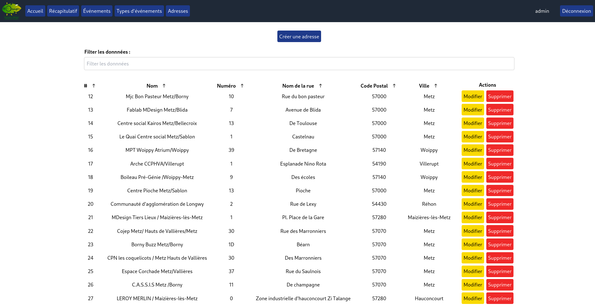
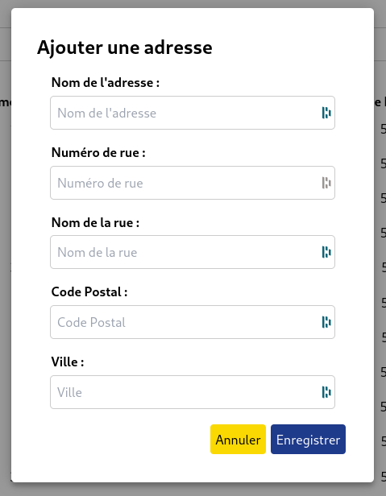
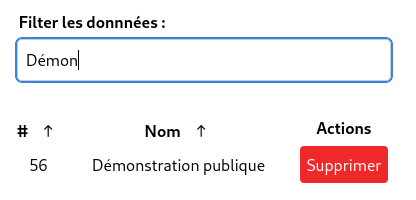
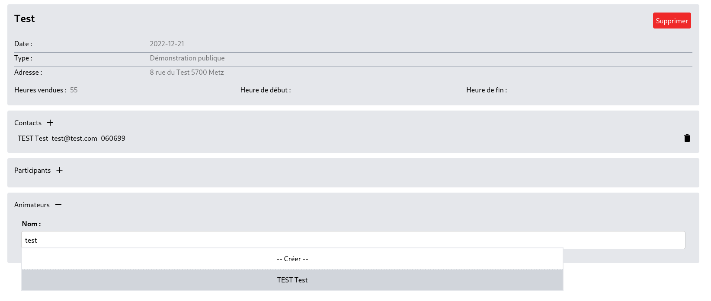
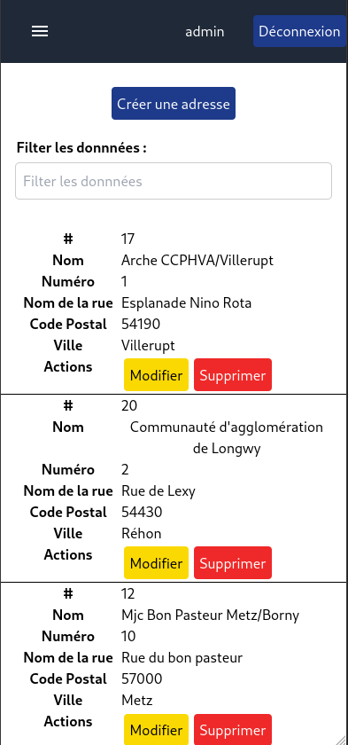
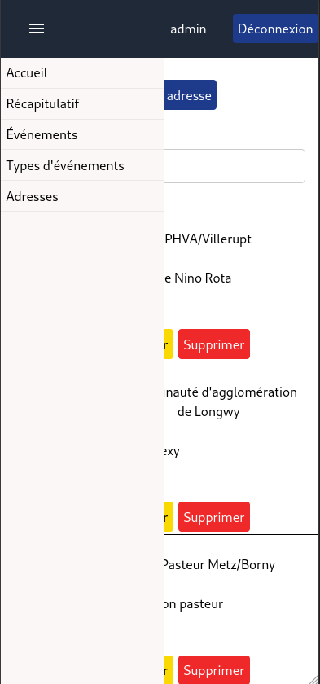

# MDesign - React Frontend

Single page application, build with React, for interacting with a REST API, built with Java Spring (see [API](https://github.com/AmbryN/mdesign-api)).

## Use case

MDesign is a Fablab based in Metz (France) which organizes events for makers, schools and public institutions.

Every month, a report containing information about all these events (number of attendees, mean age, 
gender repartition, targeted neighborhoods etc.) has to be provided to official institution (e.g. state, region).
To speed up the storage, retrieval and analysis of this data, I was tasked to develop a web application,
which will help Fablab employees with these tasks.

## Features

### Working features
* Fetching and displaying, Adding, Editing and Deleting data (CRUD) in collaboration with the Spring backend REST API, for instance:
  * Event types,
  * Addresses,

 
  * Filtering for specific items in the results

  
  * Events with their corresponding contacts, attendees and hosts
  
  
* Displaying MDesign's specific query results
* Authentication using JWT between the fronted app and the backend.
* Responsive layout for use on mobile and tablet
 
]  

## Built With

* [React](https://fr.reactjs.org/)
* [React-Router](https://reactrouter.com/en/main)
* [React-Query](https://react-query-v3.tanstack.com/)
* [Styled-Components](https://styled-components.com)
* [Tailwind](https://tailwindcss.com/)

## Authors

* **AmbryN** - *Initial work* - [AmbryN](https://github.com/AmbryN)
